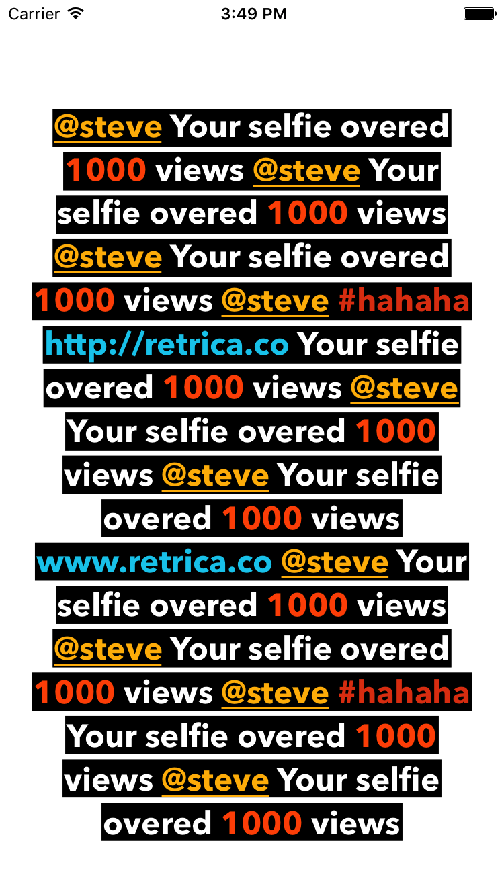

# OrangeLabel

[](https://travis-ci.org/pisces/OrangeLabel)
[](http://cocoapods.org/pods/OrangeLabel)
[](http://cocoapods.org/pods/OrangeLabel)
[](http://cocoapods.org/pods/OrangeLabel)
[](https://github.com/Carthage/Carthage)

- OrangeLabel is extensions of UILabel linkable, available line background and placeholder text

## Features
- Link for mention, hashtag, url and custom
- Placeholder text and color
- Line background

## Import

```swift
import OrangeLabel
```

## Example


```swift
let numbers = UILabelLinkType.custom(pattern: "[0-9]+")
let label = OrangeLabel()
label.adjustsFontSizeToFitWidth = true
label.enabledLinkTypes = [.mention, .hashtag, .url, numbers]
label.isUserInteractionEnabled = true
label.font = UIFont(name: "AvenirNext-Bold", size: 60)
label.minimumScaleFactor = 0.2
label.lineBackgroundColor = .black
label.lineBackgroundInset = UIEdgeInsets(top: -5, left: 5, bottom: -5, right: 5)
label.numberOfLines = 0
label.text = "@steve Your selfie overed 1000 views @steve Your selfie overed 1000 views @steve Your selfie overed 1000 views @steve #hahaha http://retrica.co Your selfie overed 1000 views @steve Your selfie overed 1000 views @steve Your selfie overed 1000 views www.retrica.co @steve Your selfie overed 1000 views @steve Your selfie overed 1000 views @steve #hahaha Your selfie overed 1000 views @steve Your selfie overed 1000 views"
label.textAlignment = .center
label.textColor = .white

label.setHighlightedLinkColor(UIColor.white.withAlphaComponent(0.5), type: .mention)
    .setHighlightedLinkColor(UIColor.white.withAlphaComponent(0.5), type: .hashtag)
    .setHighlightedLinkColor(UIColor.white.withAlphaComponent(0.5), type: .url)
    .setHighlightedLinkColor(UIColor.white.withAlphaComponent(0.5), type: numbers)
    .setAttributes([NSUnderlineStyleAttributeName: NSUnderlineStyle.styleSingle.rawValue,
                    NSForegroundColorAttributeName: UIColor(red: 1, green: 185/255, blue: 0, alpha: 1)], type: .mention)
    .setAttributes([NSForegroundColorAttributeName: UIColor(red: 225/255, green: 66/255, blue: 16/255, alpha: 1)], type: .hashtag)
    .setAttributes([NSForegroundColorAttributeName: UIColor(red: 0, green: 204/255, blue: 238/255, alpha: 1)], type: .url)
    .setAttributes([NSForegroundColorAttributeName: UIColor(red: 1, green: 85/255, blue: 0, alpha: 1)], type: numbers)

label.linkTapped { (link) in
    print(link)
}
```

## Installation

### CocoaPods

[CocoaPods](http://cocoapods.org) is a dependency manager for Cocoa projects. You can install it with the following command:

```bash
$ gem install cocoapods
```

> CocoaPods 1.1.0+ is required to build OrangeLabel 0.1.0+.

To integrate OrangeLabel into your Xcode project using CocoaPods, specify it in your `Podfile`:

```ruby
source 'https://github.com/CocoaPods/Specs.git'
platform :ios, '8.0'

target '<Your Target Name>' do
    pod 'OrangeLabel', '~> 0.1.0'
end
```

Then, run the following command:

```bash
$ pod install
```

### Carthage

[Carthage](https://github.com/Carthage/Carthage) is a decentralized dependency manager that builds your dependencies and provides you with binary frameworks.

You can install Carthage with [Homebrew](http://brew.sh/) using the following command:

```bash
$ brew update
$ brew install carthage
```

To integrate Alamofire into your Xcode project using Carthage, specify it in your `Cartfile`:

```ogdl
github "pisces/OrangeLabel" ~> 0.1.0
```

Run `carthage update` to build the framework and drag the built `OrangeLabel.framework` into your Xcode project.

## Requirements

iOS Deployment Target 8.0 higher

## Author

Steve Kim, hh963103@gmail.com

## License

OrangeLabel is available under the MIT license. See the LICENSE file for more info.
